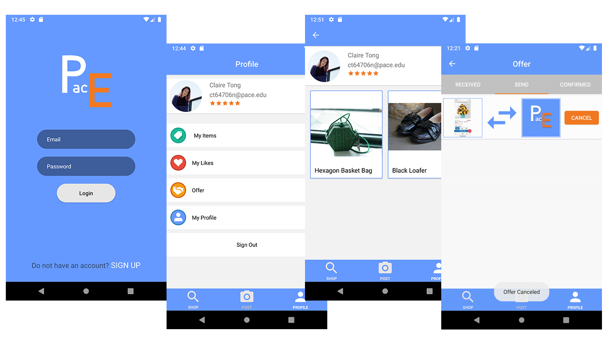

# PaceExchange
This is app designed for item exchange in campus.  
We use Firebase as the database, your need to add your own json file under app folder.  
The image processing part of code is based on CodingWithMitch on Youtube  
All customed vector icons are created by Starlla, except the heart with circle icon. 

